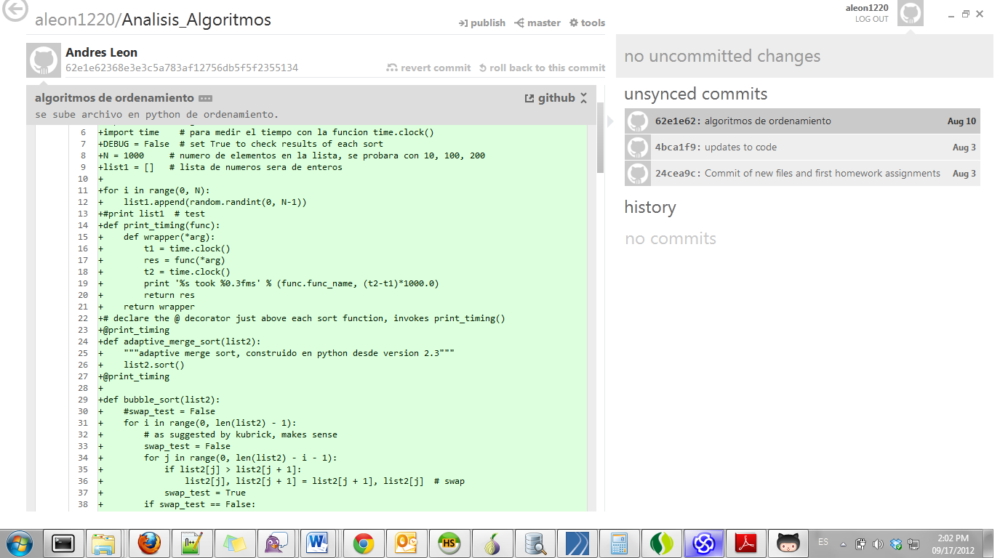

# Python code repo. Universidad Catolica de Colombia. Clase Analisis de algoritmos
La clase fue dictada por el profesor Camilo Pino [LinkedIn](https://www.linkedin.com/in/camilo-pino-07202a6/). Excelente ingeniero.

## Temas
- Complejidad de algoritmos iterativos
- Notación asintótica 
- Correctitud de algoritmos iterativos
- Recurrencias y ordenamientos

# Topics from the book Introduction to Algorithms

### LECTURE 01
• Why is Analysis of algorithms important in life?
• Insertion sort
• Asymptotic analysis
• Merge sort
• RecurrencesProf.

### LECTURE 02
- Asymptotic Notation
• O-, Ω-, and Θ-notation
• Recurrences
• Substitution method
• Iterating the recurrence
• Recursion tree
• Master method

### LECTURE 03
- Divide and Conquer
• Binary search•Powering a number•Fibonacci numbers•Matrix multiplication•Strassen’salgorithm•VLSI tree layout

### LECTURE 04
- Quicksort
• Divide and conquer
• Partitioning
• Worst-case analysis
• Intuition
• Randomized quicksort
• Analysis

### LECTURE 05
- Sorting Lower Bounds
• Decision treesLinear-Time Sorting 
• Counting sort
• Radix sort

### LECTURE 15
- Dynamic Programming
• Longest common subsequence
• Optimal substructure 
• Overlapping subproblems

### LECTURE16
- Greedy Algorithms (and Graphs)
• Graph representation
• Minimum spanning trees
• Optimal substructure
• Greedy choice
• Prim’s greedy MST algorithm

Copyright © 2001-2005 Erik D. Demaine and Charles E. Leiserson

### Memories github 2012
